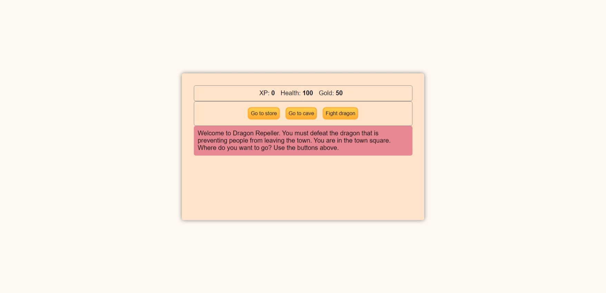

# Dragon Repeller Game

## Description:

This is a text-based adventure game called "Dragon Repeller." The player starts with 0 XP, 100 Health, and 50 Gold. The objective is to defeat a dragon that is preventing people from leaving the town. The game is built using HTML, CSS, and JavaScript, and it can be played directly in the browser. The player can choose to go to the store, go to the cave, or fight the dragon. The outcome of each action depends on the player's choices and the randomness of the game. The game is designed to be simple and entertaining, suitable for users of all ages.

## Screenshot

